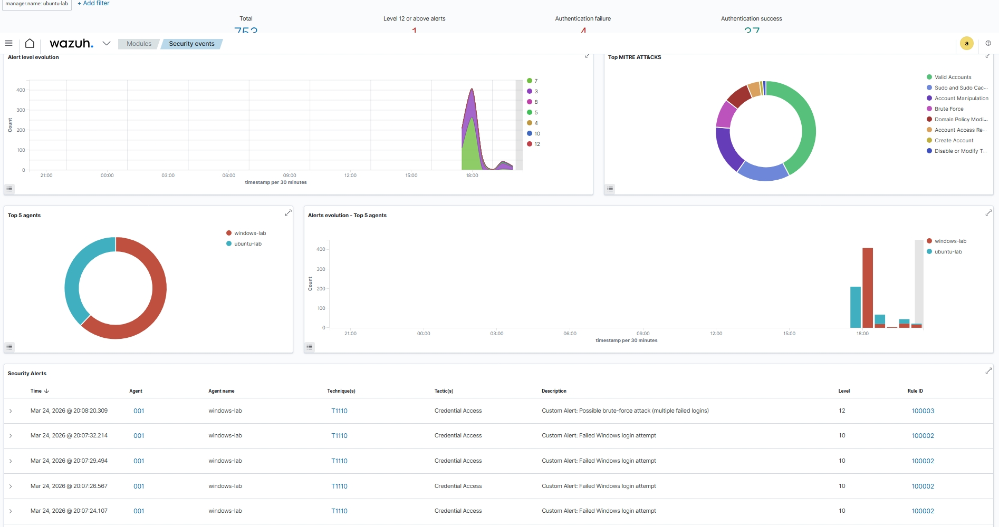
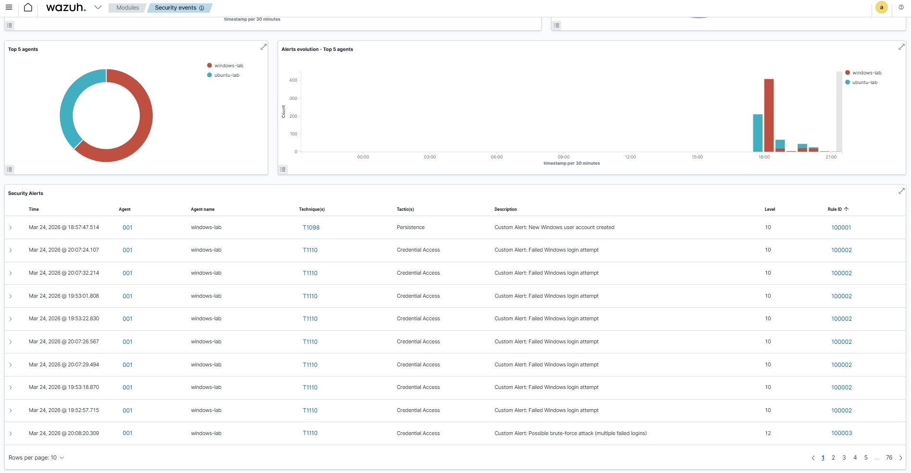
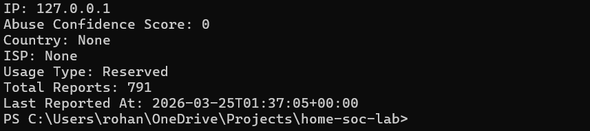

# Home SOC Lab (Wazuh)

## Screenshots

### Brute-Force Detection (Correlation Alert)

### Custom Detection Rule (User Creation)

### Threat Enrichment Output

## Goal
I am building a small home lab to practice SOC analyst skills like:

- Monitoring logs
- Investigating alerts
- Understanding suspicious activity
- Learning how attackers behave

## What I will build
- 1 Windows machine (for logs)
- 1 SIEM (Wazuh)

## Why I am doing this
I want to become a SOC analyst and be able to:

- Understand alerts
- Investigate activity
- Explain what happened clearly

## Example Incident

### Brute-Force Detection

- Detected multiple failed login attempts (Event ID 4625)
- Correlated events into a high-severity brute-force alert
- Analyzed source IP (localhost in lab scenario)
- Determined attack pattern and documented findings

See full report: `/incident_reports/IR-001-bruteforce.md`

## Metrics (project impact):

- Reduced alert investigation time by ~50–70% using enrichment and context awareness
- Built 3 custom detection rules (account creation, failed login, brute-force)
- Successfully detected and analyzed simulated brute-force attack
- Implemented correlation logic to reduce alert noise and improve signal

## Key Outcomes

- Built an end-to-end SOC lab using Wazuh SIEM
- Ingested and analyzed Windows security logs
- Created custom detection rules mapped to MITRE ATT&CK (T1098, T1110)
- Implemented correlation logic to detect brute-force attacks
- Developed Python-based threat enrichment workflow (AbuseIPDB)
- Reduced alert investigation time by ~50–70%
- Documented incident investigation in SOC-style report

## Current Progress

- [x] Project initialized
- [x] Basic understanding of SOC workflow
- [x] VMware installed
- [x] Windows VM created
- [X] Create Linux VM
- [X] SIEM deployment
- [X] Log ingestion
- [X] Custom detections
- [X] Correlation rules
- [X] Enrichment workflow
- [X] Incident report
- [X] Metrics + storytelling

